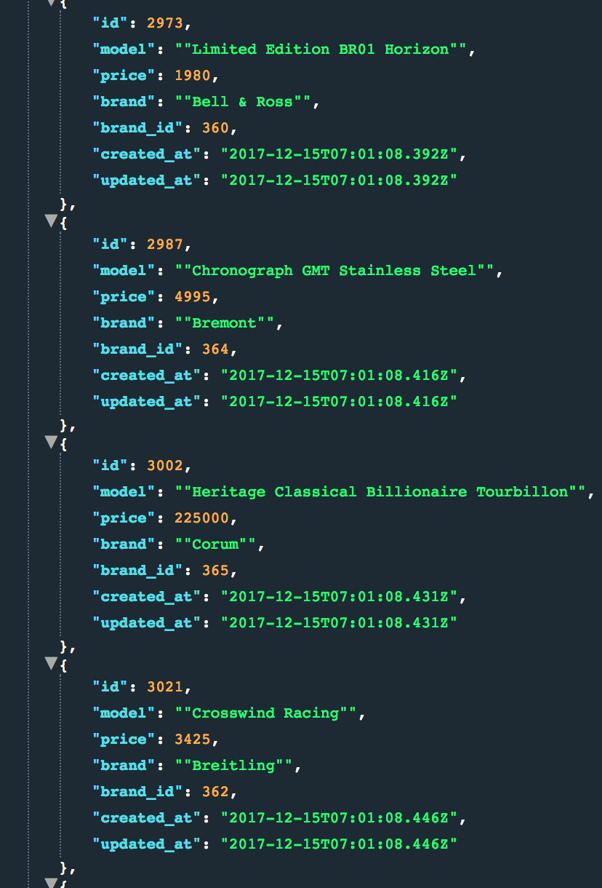
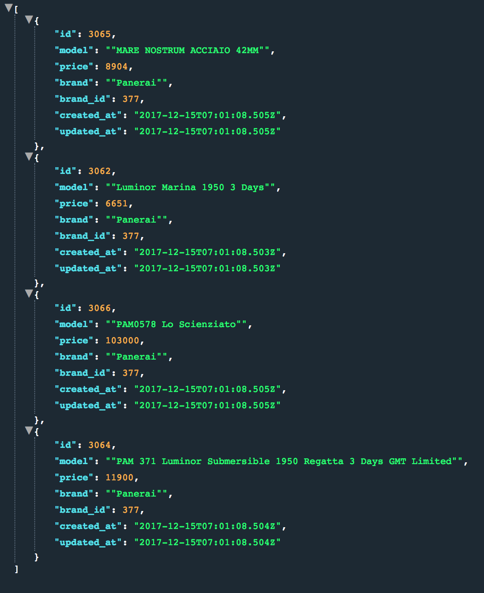
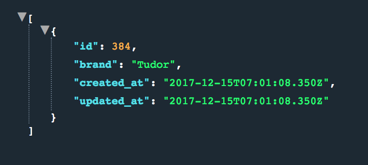
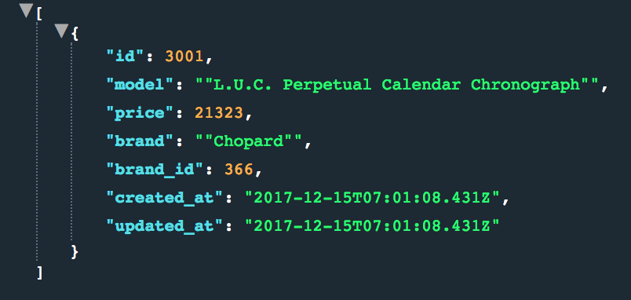

######BYOB#######

This backend application provides a user with a list of the 32 top luxury watch
brands.  The dataset also contains price information and model name of five watches
per brand.

The API is REST API and uses OAuth 1.0a for user authentication purposes. Currently, return format for all endpoints is JSON.

You can apply for a for a web token at the main page.  Email must end with turing.io to have admin privileges.
[BYOB Link](https://hs-byob-12-17-2017.herokuapp.com/)

------------------------------------------------------------------------------------------------------------------------------

### GET Brands ###

/api/v1/brands

Make a get request to this endpoint to retrieve a list of the 32 top luxury watch brands

Example of response format:

------------------------------------------------------------------------------------------------------------------------------

### GET watches ###

/api/v1/watches

Make a get request to this endpoint to retrieve a list every watch model contained in database.

Example of response format:

------------------------------------------------------------------------------------------------------------------------------

### Get Watch Models by Brand Id ###

/api/v1/brand/:id/watches

Make a get request to this endpoint to retrieve a list of five watch models by brand.  Response will provide
watch price, model name, model brand, and brand_id.  

Must pass in brand id as a param in URL.

For this example: /api/v1/brand/377/watches

Example of response format:

------------------------------------------------------------------------------------------------------------------------------

### Get Watch Brand by ID ###

/api/v1/brand/:id

Make a get request to this endpoint to retrieve a single brand by passing in the brand id as a param in URL.

For this example: /api/v1/brand/384

Example of response format:

------------------------------------------------------------------------------------------------------------------------------

### Get Watch Brand by ID ###

/api/v1/watches/:id

Make a get request to this endpoint to retrieve a single watch by passing in the watch id as a param in URL.

For this example: /api/v1/watches/3001

Example of response format:

------------------------------------------------------------------------------------------------------------------------------

### GET watch models and filter by price ###

/api/v1/watches?min={integer}&max={integer}

You can pass in min and max params with values to filter watches by price.  

Example: /api/v1/watches?min=0&max=10000

This will retrieve a list of every watch priced in between 0 to 10,000.

------------------------------------------------------------------------------------------------------------------------------

### POST new brand to DB ###

/api/v1/brands

Make a post request to this endpoint to add a brand to the watch brands list.
User token must have admin privileges in order to be able to add new brand.

Required params: brand & token

Must parse request body into JSON.

Request Body:

{
  brand: "Bulova",
  token: "token value"
}

Success Response:
Code: 201

Error Response:
Code: 422
Content: { error: 'Missing brand name.' }

Error Response:
Code: 500 NOT FOUND
Content: { error: Internal Server Error }

------------------------------------------------------------------------------------------------------------------------------

### POST new watch to DB ###

/api/v1/brands/:id/watches

Make a post request to this endpoint to add a new watch to database, must pass in brand id into URL.
User token must have admin privileges in order to be able to add new watch.

Required params: brand, model, price, & token.

Request Body:

{
  brand: "Rolex",
  mode: "Yacht master",
  price: 50000
  token: "token value"
}

Success Response:
Code: 201

Error Response:
Code: 422
Content: { error: 'Missing a required parameter.' }

Error Response:
Code: 500 NOT FOUND
Content: { error: Internal Server Error }

------------------------------------------------------------------------------------------------------------------------------

### PATCH existing brand ###

/api/v1/brands/:id

Make a patch request to this endpoint to update brand value in database, must pass in brand id into URL.
User token must have admin privileges in order to be able to update brand value.

Required params: brand & token.

Request Body:

{
  brand: "Rolex",
  token: "token value"
}

Success Response:
Code: 204

Error Response:
Code: 422
Content: { error: `Must send patch as object literal with a key of brand and string value and key of token with token value.` }

Error Response:
Code: 500 NOT FOUND
Content: { error: Internal Server Error }

------------------------------------------------------------------------------------------------------------------------------

### PATCH existing watch model ###

/api/v1/watches/:id

Make a patch request to this endpoint to update watch key values in database, must pass in watch id into URL.
User token must have admin privileges in order to be able to update watch key values.

Required params: brand, token, model, price.

Request Body:

{
  brand: "Rolex",
  price: 11000,
  model: "Yacht Master Tourbillon",
  token: "token value"
}

Success Response:
Code: 204

Error Response:
Code: 422
Content: { error: `Must send patch as object literal with a keys of brand and model with string values, key of price with integer value,  and key of token with token value.` }

Error Response:
Code: 500 NOT FOUND
Content: { error: Internal Server Error }

------------------------------------------------------------------------------------------------------------------------------

### Delete watch brand ###

/api/v1/brands/:id

Make a delete request to destroy brand in database.  Must pass in brand id into URL.
User token must have admin privileges in order to be able to destroy brand from database.

Success Response:
Code: 204

Error Response:
Code: 422
Content: { error: `Brand not found` }

Error Response:
Code: 500 NOT FOUND
Content: { error: Internal Server Error }

------------------------------------------------------------------------------------------------------------------------------

### Delete watch watch model ###

/api/v1/watches/:id

Make a delete request to destroy watch model in database.  Must pass in watch id into URL.
User token must have admin privileges in order to be able to destroy watch model from database.

Success Response:
Code: 204

Error Response:
Code: 422
Content: { error: `Watch model  not found` }

Error Response:
Code: 500 NOT FOUND
Content: { error: Internal Server Error }
