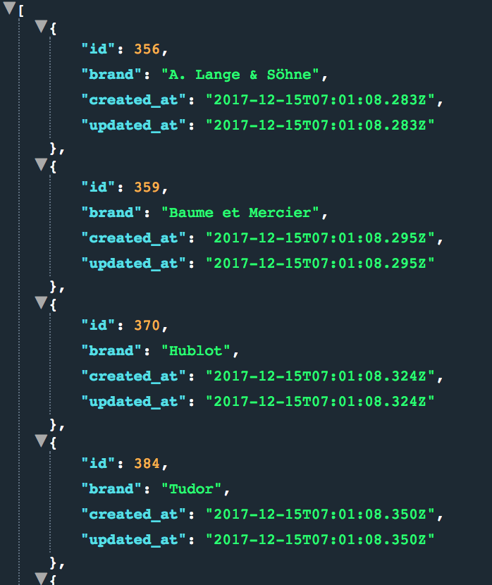

######BYOB#######

This backend application provides a user with a list of the 32 top luxury watch
brands.  The dataset also contains price information and model name of five watches
per brand.

The API is REST API and uses OAuth 1.0a for user authentication purposes. Currently, return format for all endpoints is JSON.

You can apply for a for a web token at the main page.  Email must end with turing.io to have admin access.
[BYOB Link](https://hs-byob-12-17-2017.herokuapp.com/)

------------------------------------------------------------------------------------------------------------------------------

### GET Brands ###

/api/v1/brands

Make a get request to this endpoint to retrieve a list of the 32 top luxury watch brands

Example of response format:

------------------------------------------------------------------------------------------------------------------------------

### GET watches ###

/api/v1/watches

Make a get request to this endpoint to retrieve a list every watch model contained in database.

Example of response format:

------------------------------------------------------------------------------------------------------------------------------

### Get Watch Models by Brand Id ###

/api/v1/brand/:id/watches

Make a get request to this endpoint to retrieve a list of five watch models by brand.  Response will provide
watch price, model name, model brand, and brand_id.  

Must pass in brand id as a param in URL.

For this example: /api/v1/brand/377/watches

Example of response format:

------------------------------------------------------------------------------------------------------------------------------

### Get Watch Brand by ID ###

/api/v1/brand/:id

Make a get request to this endpoint to retrieve a single brand by passing in the brand id as a param in URL.

For this example: /api/v1/brand/384

Example of response format:

------------------------------------------------------------------------------------------------------------------------------

### Get Watch Brand by ID ###

/api/v1/watches/:id

Make a get request to this endpoint to retrieve a single watch by passing in the watch id as a param in URL.

For this example: /api/v1/watches/3001

Example of response format:

